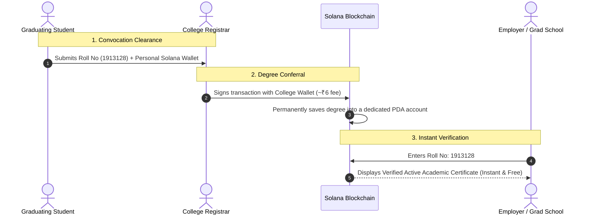

# AlmaChain: On-Chain Academic Degree Registry
> A decentralized, soulbound academic credentialing and degree verification protocol built on Solana.

Built by **Sheshank Chandra Pothu** (Scholar ID: 1913128) during the **S.N. Bose Summer Internship (2022)** at the Department of Computer Science & Engineering, **National Institute of Technology Silchar**, under the guidance of **Dr. Malaya Dutta Borah**.

---

## What is AlmaChain?

Degree fraud is a massive global issue. Fake degrees and forged PDF certificates cost universities and employers millions every year. Furthermore, verifying an Indian degree for a job or university abroad (through agencies like WES, apostille, or embassies) often takes **weeks** and costs **hundreds of dollars** per student.

**AlmaChain** is a working prototype that solves this using the **Solana blockchain**:

1. **For the College (Registrar):** The university enters student details (Name, Roll No, CGPA) and signs a transaction. The degree certificate is permanently recorded into a dedicated, tamper-proof account on Solana for about ₹6 (less than 9 cents).
2. **For the Student:** The degree is permanently tied to the student's identity. Because there are no transfer functions, it cannot be sold, stolen, or moved to another person (it is natively "Soulbound").
3. **For Employers & Grad Schools (Microsoft, UIUC, WES):** Anyone can visit the website, type a Roll Number (like `1913128`), and instantly verify the official university degree in **1 second for free**—**no crypto wallet or login required**.

---

## Video Walkthrough & Demo

Watch the complete demonstration showing both the **Registrar issuance workflow** (signing on Solana Devnet via Phantom) and the **zero-wallet instant verification**:

https://github.com/user-attachments/assets/e84181d6-2b23-4339-948b-85a08b317ee9

---

## How It Works in 3 Simple Steps



---

## Quickstart: How to Run It Locally

### Prerequisites
- Node.js (v16+)
- A modern web browser with the [Phantom Wallet](https://phantom.app/) extension (if testing the Registrar issuance flow)

### 1. Clone & Start the Web App
```bash
# Clone the repository
git clone https://github.com/<your-username>/AlmaChain.git
cd AlmaChain/app

# Install dependencies
npm install

# Start the local development server
npm start
```

Open [http://localhost:3000](http://localhost:3000) in your browser:
- **Public Verifier Tab:** Type `1913128` and click **Verify Record** to view the live certificate.
- **Registrar Tab:** Connect your Phantom wallet (switched to Devnet in Phantom Settings) to test issuing a new degree.

---

## Technical Specifications & Architecture Deep Dive

Curious about how this works under the hood at the systems and smart contract layer?

Check out our comprehensive technical documentation:  
👉 **[Read the Full Architecture & Technical Spec](docs/ARCHITECTURE.md)**

Topics covered in the technical document:
- **Solana PDA Topology:** Why native Program Derived Addresses make credentials mathematically Soulbound without needing token wrappers or freeze authorities.
- **Exact 226-Byte Memory Layout:** Detailed Borsh serialization offsets, discriminators, and account sizing.
- **Solana vs. Ethereum Architecture:** Sealevel parallel runtime execution vs. Ethereum global contract storage locks.
- **Rent Economics:** Complete mathematical breakdown of the 0.00246 SOL (~₹6) refundable rent-exemption deposit vs. EVM `SSTORE` gas fees.
- **Smart Contract Safety:** Account authorization checks (`has_one = university`) and immutable revocation audit trails.

---

## Project Credits

- **Student:** Sheshank Chandra Pothu (Scholar ID: 1913128)
- **Faculty Guide:** Dr. Malaya Dutta Borah
- **Department:** Department of Computer Science & Engineering, National Institute of Technology Silchar
- **Program:** S.N. Bose Summer Research Internship (2022)
